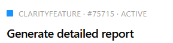

- [ ] **[[High]]** onwer must apporve under "Approve by: " 
    - [ ] Must for complition.
- [ ] options to add notes
    - [ ] general.
    - [ ] comment like word.
- [x] UI looks very buzzy.
- [ ] add user manual to chat context. 
- [ ] producs add to sharpoint, talk with Gal.
- [ ] the chat should challange the user ragarding the requests. 
  - [ ] confilcs
  - [ ] if it exists, or simillar feature. 
  - [ ] Auther
- [ ] Hard to notice when the coach is thinking
- [x] Theme !? 
- [ ] Lables for assigned, Author and ... 
- [ ] consider using larger gearwheel. 
- [ ] verify auto complete is the same as in Azure
  - [ ] filter all not "Clarity Feature"
- [ ] fix: right top button Push to Azure in Edit page, name is wrong.
- [x] edit page, make two section ajustable. 
- [ ] when pulish to azure, should save revision. 
- [ ] Anotation tool, revert to original. 
- [ ] fix: anotation text does not work. 
- [x] TFS should be linkable.
  - [x] should be added to the User Story (next to the title)
- [x] Swap chat and user story
- [x] change nerative to: "As-a, I-want, So-that"
  - [x] "I want to" => "I want" 
- [ ] multi selection selction is not noticable. 
- [ ] Add new section "The scenario", open text (user input with claude audeting). 
- [ ] written by should be on the top after the title. preview page 
- [ ] date and time preview page
- [ ] fix: darg and drop.

## Sidebar
- [x] sidebar, 
- [x] the left list is too blue (should match the design of the rest)
- [x] side bar search by number (add)

## Preview Page
- [ ] preview page, button on the top. 
- [ ] preview should be in the same order as the edit page. 
- [ ] no need for assign and state in preview page. 
- [ ] clarity feture should be clickable preview page

## Plans:

1. Coach context:

```text
/plan I want to create log of Items added to context:                                                                                
  1. the log should be shown if the user click on the gearwheel on coach title.                                                        
  2. when the user return to edit user story, the old context should be loaded. 

```
